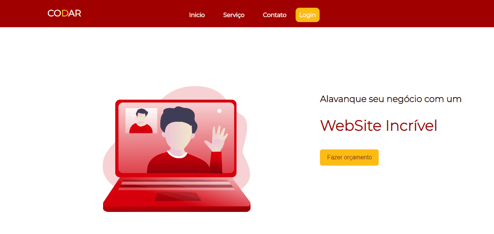

# WebSite Empresa CODAR

## Site criado como modelo de treinamento e Desing 

STATUS-EM DESENVOLVIMENTO 


## Rodando localmente

Clone o projeto

```bash
  git clone https://link-para-o-projeto
```

Entre no diretório do projeto

```bash
  cd my-project
```

Instale as dependências

```bash
  npm install
  node-sass 
  react-route-dom
  react-icons
```


Para melhor visualização do Scss digite no package

```bash
    scripts:{
         "sass":"node-sass --watch pasta.sass -o pasta.css"
    }
```

Inicie o servidor

```bash
  npm run start
```



# Próxima Sprint
Será implementado seções de valores, modals dinâmicos
## Suporte

Para suporte, mande um email para joaodevelopment7@gmail.com ou através do meu Linkedin

